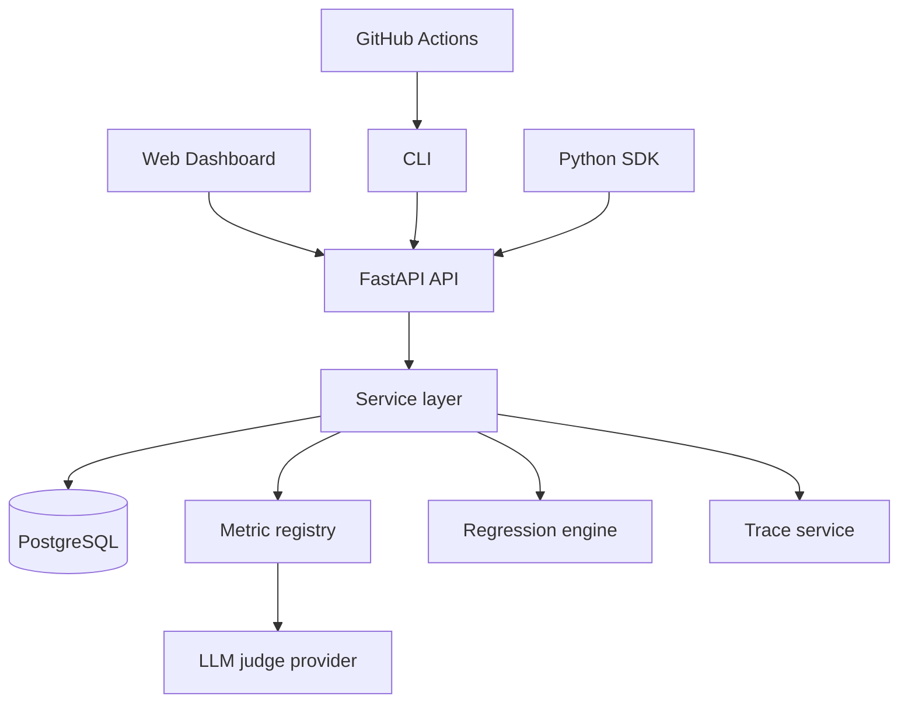
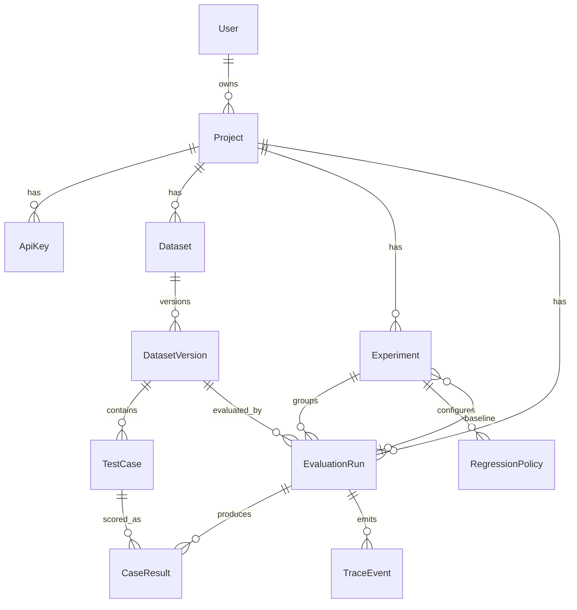
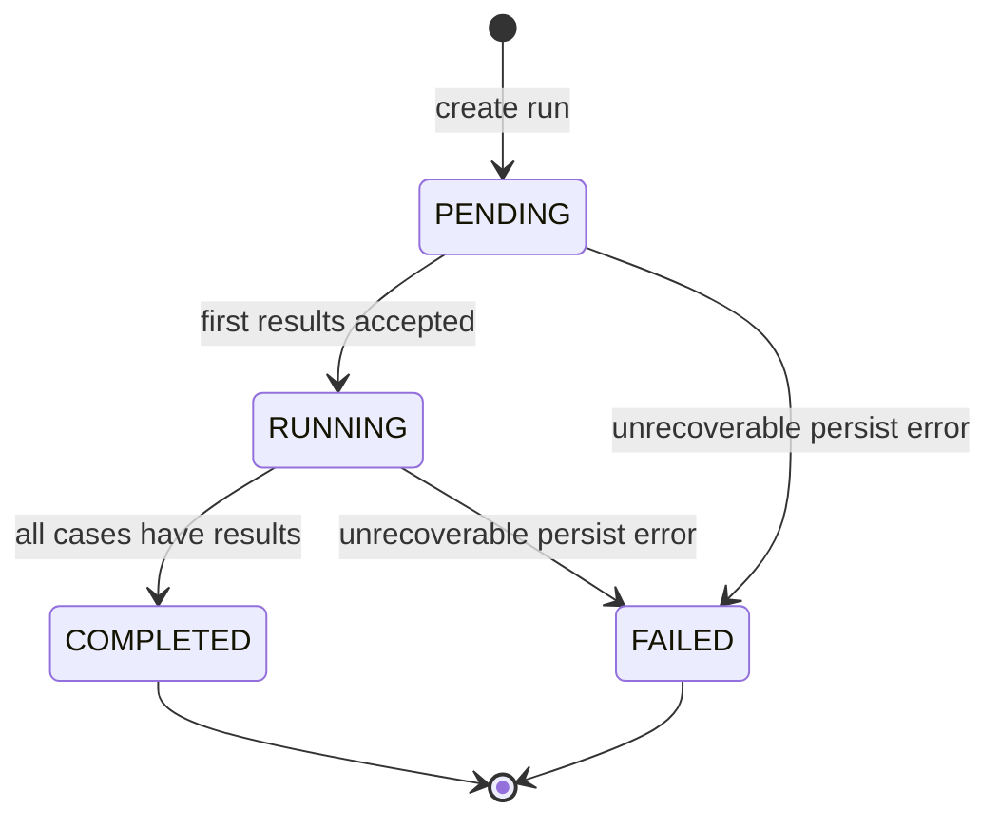

# EVALSURE Architecture

## System overview

EVALSURE is a **modular monolith**: one FastAPI application owns HTTP, business logic, and persistence. Clients (web dashboard, CLI, SDK, CI) talk to the same REST API.



## Backend modules (`apps/api`)

| Package | Responsibility |
|---------|----------------|
| `app.auth` | Register/login, JWT, API-key auth, ownership checks |
| `app.projects` | Projects + API key lifecycle (hash-only storage) |
| `app.datasets` | Datasets, immutable versions, test cases |
| `app.evaluations` | Runs, result submission, scoring orchestration |
| `app.metrics` | Metric registry (`exact_match`, `string_similarity`, `llm_judge`) |
| `app.judge` | Optional OpenAI-compatible judge provider |
| `app.experiments` | Experiments + baseline pointer |
| `app.regression` | Policies + regression evaluation |
| `app.traces` | Append-only sanitized events |
| `app.core` | Config, DB, pagination, errors, logging, middleware |

Alembic migrations: `apps/api/alembic/versions/`.

## Database relationships (conceptual)



Important constraints enforced in the schema:

- Unique `(dataset_id, version)`  
- Unique `(dataset_version_id, external_id)`  
- Unique `(run_id, test_case_id)` for case results  
- Unique `(experiment_id, metric_name)` for policies  
- Unique `(project_id, name)` for experiments  
- API keys store **hash only** (`key_hash` unique)

## Evaluation lifecycle



Rules:

- Clients submit **actual outputs**; the backend computes metric scores.  
- Completed / failed runs **reject** further submissions.  
- Regression FAIL does **not** change run status from COMPLETED.

## Metric engine

`MetricRegistry` resolves metric names from the run’s frozen `config_snapshot`.

| Metric | Notes |
|--------|--------|
| `exact_match` | Deterministic equality-style scoring |
| `string_similarity` / `similarity` | Deterministic similarity |
| `llm_judge` | Optional; requires `EVALSURE_JUDGE_API_KEY`; failures fail the **case**, not necessarily the whole run |

Secrets are stripped from `config_snapshot` and never written to traces.

## Regression engine

1. Experiment holds `baseline_run_id` (pointer only — baseline run is not mutated).  
2. Policies define `max_allowed_drop`, optional `min_aggregate_score`, `max_regressed_cases`.  
3. `POST /runs/{id}/evaluate-regression` compares current vs baseline aggregates and cases.  
4. Missing / incomparable cases are reported — not silently treated as zero.  
5. Outcomes: `PASS`, `FAIL`, or `NOT_EVALUATED` (no baseline / no policies / not linked).

## Traces

Append-only `TraceEvent` rows: run started/completed/failed, case lifecycle, metric evaluation, model call metadata (no secrets). Payloads are sanitized and size-bounded.

## Authentication

| Mode | Header / store | Use |
|------|----------------|-----|
| JWT | `Authorization: Bearer` | Humans, dashboard cookie, project create/list |
| API key | `X-API-Key: evs_…` | SDK/CLI/CI; hashed at rest; revoked keys fail |

Ownership: JWT users only access projects they own. API keys are scoped to a single project.

## Developer-facing errors

Responses use a stable envelope:

```json
{ "error": { "code": "RUN_NOT_FOUND", "message": "Evaluation run was not found." } }
```

Common codes: `UNAUTHORIZED`, `FORBIDDEN`, `VALIDATION_ERROR`, `PROJECT_NOT_FOUND`, `DATASET_NOT_FOUND`, `DATASET_VERSION_NOT_FOUND`, `RUN_NOT_FOUND`, `DUPLICATE_RESULT`, `INVALID_RUN_STATE`, `INVALID_METRIC`, `REGRESSION_NOT_EVALUATED`, `NOT_FOUND`, `CONFLICT`, `BAD_REQUEST`.

## SDK / CLI

- `packages/sdk` — typed `EvalSureClient` (httpx)  
- `packages/cli` — Typer app `evalsure` calling the SDK only  

Both respect `EVALSURE_API_URL`, `EVALSURE_API_KEY`, `EVALSURE_ACCESS_TOKEN`.

## GitHub Actions

`.github/workflows/evalsure.yml` runs when root `evalsure.yml` exists:

1. Install SDK + CLI  
2. Expect `evalsure-results.json` from the consumer pipeline  
3. `evalsure ci run --config evalsure.yml --results evalsure-results.json`  

Exit codes: `0` pass · `1` regression · `2` config · `3` API/auth/network.

## Web dashboard (`apps/web`)

Next.js App Router UI:

- JWT login/register (httpOnly cookie via Next route handlers)  
- Browse projects, datasets, experiments, runs  
- Run comparison vs baseline  
- Traces viewer  
- Project API key management  

Server components call the API with the cookie (or optional `EVALSURE_ACCESS_TOKEN`). In Docker, SSR uses `EVALSURE_API_INTERNAL_URL` (`http://api:8000`) while the browser uses `NEXT_PUBLIC_API_URL` (`http://localhost:8000`).

## Deployment shape

Docker Compose services: `db` (Postgres 16) → `api` (migrate + uvicorn) → `web` (Next standalone). Not a microservices mesh; no Redis/Kubernetes in this architecture.
